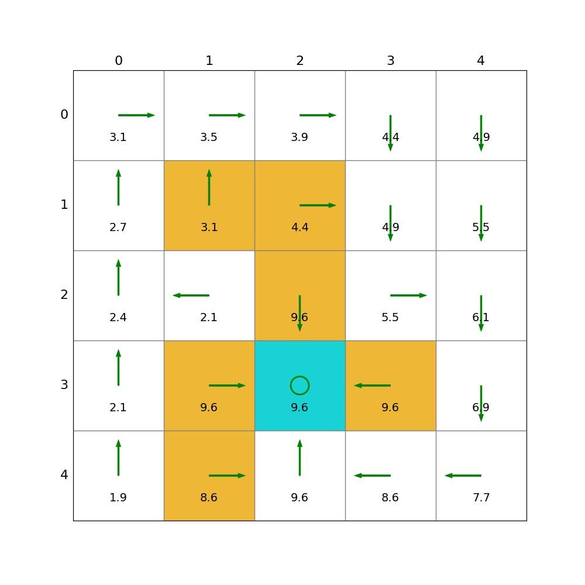
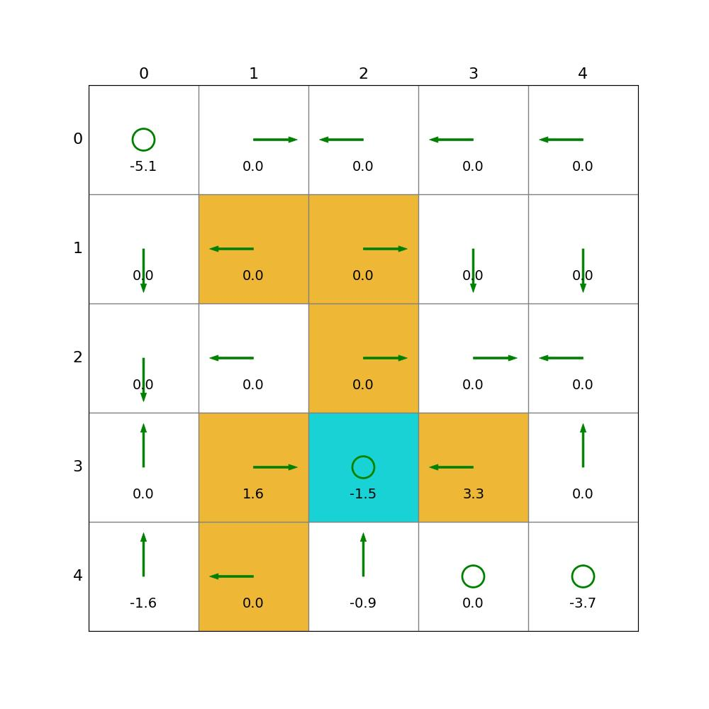
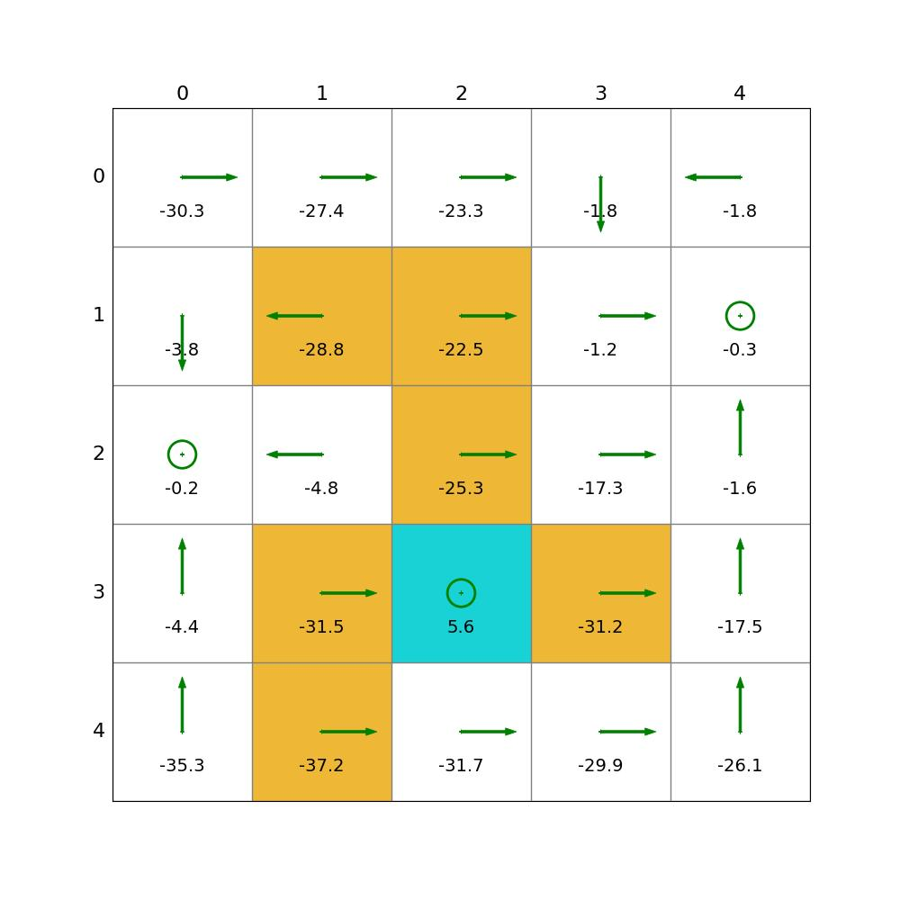

# Code of Mathmatic in Reinforcement Learning

## Implemented Methods

- value and policy iteration
- monte carlo learning
    - mc_basic
    - mc_exploring_starts
    - mc_epsilon_greedy

## Some Results

### Value iteration and Policy iteration

Task: Using value iteration and policy iteration to find the optmial state value and policy.

the result of policy iteration: 

the result of value iteration:

### Monte Carlo Learning

Task: Using MC learning to find the optmial state value and policy.

the result of MC basic: 

the result of MC exploring starts:

the result of MC-epsilon greedy:

